# Example 1 -------------------------------------------------------------------------------------------------------

# Look at the output from curated data


```r
df <- tribble(
    ~dist_points, ~sales,
    1, 10,
    2, 20,
    3, 30,
    4, 40,
    5, 50,
    6, 60,
    7, 70,
    8, 80,
    9, 90,
    10, 100
)

# data is generated according to a simple linear function
k <- 10
x <- 1:10
d <- 0


(plt1 <- df %>% 
        ggplot(aes(x = dist_points, y = sales)) +
        geom_point() +
        scale_x_continuous(breaks = seq(1,10)) +
        scale_y_continuous(breaks = seq(10,100,10))
)
```

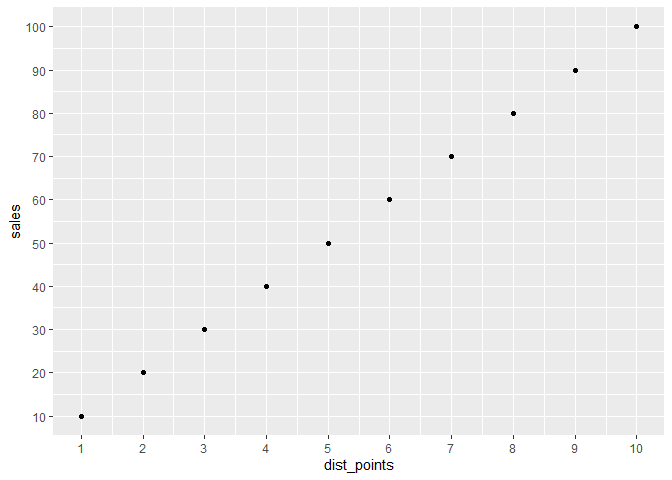<!-- -->


```r
mean <- mean(df$sales)

(plt2 <- plt1 +
        geom_hline(yintercept = mean) +
        geom_text(x = 1, y = 60, label = mean)
)
```

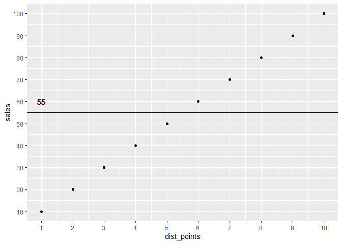<!-- -->


```r
# manually predict sales
pred_sales <- k * x + d
pred_sales_df <- tibble(x = x, pred_sales = pred_sales)

(plt3 <- plt2 +
        geom_hline(yintercept = mean) +
        geom_text(x = 1, y = 60, label = mean) +
        geom_line(data = pred_sales_df, aes(x = x, y = pred_sales), col = 'blue')
)
```

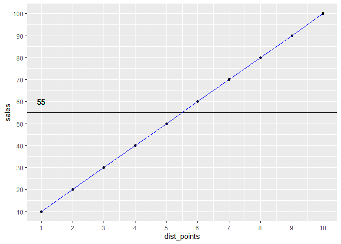<!-- -->

## Calculate R squared manually

StatQuest: <https://www.youtube.com/watch?v=2AQKmw14mHM>


```r
var_mean <- var(mean - df$sales)
var_line <- var(pred_sales_df$pred_sales - df$sales)

(r_squared <- (var_mean - var_line) / var_mean)
```

```
## [1] 1
```

```r
# 1
```


```r
(plt4 <- plt3 +
        geom_hline(yintercept = mean) +
        geom_text(x = 1, y = 60, label = mean) +
        geom_line(data = pred_sales_df, aes(x = x, y = pred_sales), col = 'blue') + 
        geom_text(x = 9, y = 70, label = paste0('R^2 = ', r_squared), col = 'blue')
)
```

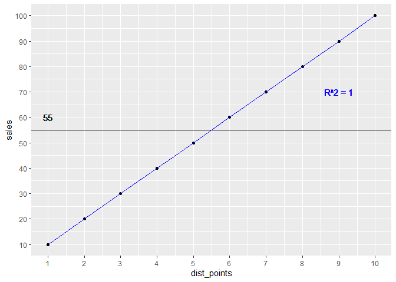<!-- -->

## Run lm()

Expectation: 
k = 10 - 
std error = 0 
R squared = 1 
multiple r
squared = 1 
residual standard error = 0 
d = 0 
deg freedom = 10 - 1 (paramter) - 1 (intercept) = 8


```r
lm_res <- lm(sales ~ dist_points, data = df)
summary(lm_res)
```

```
## Warning in summary.lm(lm_res): essentially perfect fit: summary may be
## unreliable
```

```
## 
## Call:
## lm(formula = sales ~ dist_points, data = df)
## 
## Residuals:
##        Min         1Q     Median         3Q        Max 
## -9.511e-15 -2.387e-15 -4.041e-16  3.247e-15  6.630e-15 
## 
## Coefficients:
##               Estimate Std. Error    t value Pr(>|t|)    
## (Intercept) -8.988e-15  3.472e-15 -2.588e+00   0.0322 *  
## dist_points  1.000e+01  5.596e-16  1.787e+16   <2e-16 ***
## ---
## Signif. codes:  0 '***' 0.001 '**' 0.01 '*' 0.05 '.' 0.1 ' ' 1
## 
## Residual standard error: 5.083e-15 on 8 degrees of freedom
## Multiple R-squared:      1,	Adjusted R-squared:      1 
## F-statistic: 3.193e+32 on 1 and 8 DF,  p-value: < 2.2e-16
```

```r
# Residuals:
#     Min         1Q     Median         3Q        Max 
# -9.511e-15 -2.387e-15 -4.041e-16  3.247e-15  6.630e-15 
# 
# Coefficients:
#     Estimate Std. Error    t value Pr(>|t|)    
# (Intercept) -8.988e-15  3.472e-15 -2.588e+00   0.0322 *  
#     dist_points  1.000e+01  5.596e-16  1.787e+16   <2e-16 ***
#     ---
#     Signif. codes:  0 ‘***’ 0.001 ‘**’ 0.01 ‘*’ 0.05 ‘.’ 0.1 ‘ ’ 1
# 
# Residual standard error: 5.083e-15 on 8 degrees of freedom
# Multiple R-squared:      1,	Adjusted R-squared:      1 
# F-statistic: 3.193e+32 on 1 and 8 DF,  p-value: < 2.2e-16
```


```r
pred_lm <- tibble(y = predict(lm_res, tibble(dist_points = df$dist_points)) , dist_points = df$dist_points)

(plt1 + geom_line(data = pred_lm, aes(x = dist_points, y = y), col = 'red')
)
```

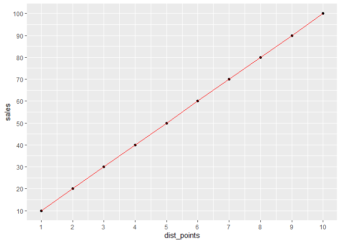<!-- -->


# Example 2 -------------------------------------------------------------------------------------------------------
What happens if there is no correlation at all between input and output?

```r
set.seed(42)
df_no_corr <- tibble(sales = df$sales, dist_points = sample(1:10, 10))

(plt_no_corr_1 <- df_no_corr %>% 
        ggplot(aes(x = dist_points, y = sales)) +
        geom_point() +
        scale_x_continuous(breaks = seq(1,10)) +
        scale_y_continuous(breaks = seq(10,100,10))
)
```

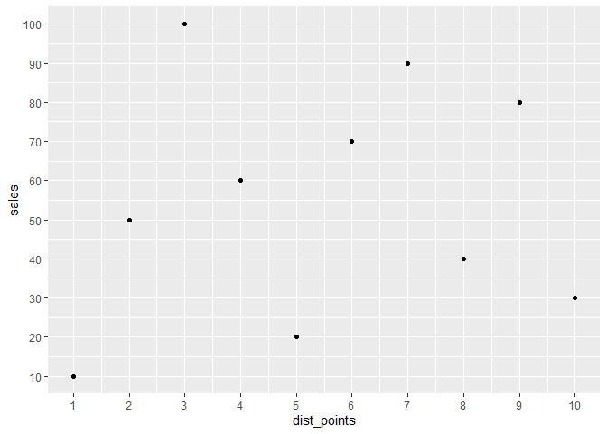<!-- -->
Expectation:
- k = 0
- R squared = 0
- multiple r squared = 0
- residual standard error = ~25
- d = 55


```r
lm_res_no_corr <- lm(sales ~ dist_points, data = df_no_corr)
summary(lm_res_no_corr)
```

```
## 
## Call:
## lm(formula = sales ~ dist_points, data = df_no_corr)
## 
## Residuals:
##     Min      1Q  Median      3Q     Max 
## -38.727 -28.076   3.485  18.667  48.485 
## 
## Coefficients:
##             Estimate Std. Error t value Pr(>|t|)  
## (Intercept)   47.333     21.723   2.179    0.061 .
## dist_points    1.394      3.501   0.398    0.701  
## ---
## Signif. codes:  0 '***' 0.001 '**' 0.01 '*' 0.05 '.' 0.1 ' ' 1
## 
## Residual standard error: 31.8 on 8 degrees of freedom
## Multiple R-squared:  0.01943,	Adjusted R-squared:  -0.1031 
## F-statistic: 0.1585 on 1 and 8 DF,  p-value: 0.7009
```

```r
# Coefficients:
#     Estimate Std. Error t value Pr(>|t|)  
# (Intercept)   47.333     21.723   2.179    0.061 .
# dist_points    1.394      3.501   0.398    0.701  
# ---
#     Signif. codes:  0 ‘***’ 0.001 ‘**’ 0.01 ‘*’ 0.05 ‘.’ 0.1 ‘ ’ 1
# 
# Residual standard error: 31.8 on 8 degrees of freedom
# Multiple R-squared:  0.01943,	Adjusted R-squared:  -0.1031 
# F-statistic: 0.1585 on 1 and 8 DF,  p-value: 0.7009

# k .. low but still not 0 !!!!!
# r squared .. low -> OK
# residual standard error -> OK
# d .. not 55, but ok
```

# Lets make the simulation more accurate -> use 100times more data points


```r
set.seed(42)
df_no_corr2 <- tibble(sales = rep(df$sales, 100) , dist_points = sample(1:10, 10 * 100, replace = T))

(plt_no_corr_2 <- df_no_corr2 %>% 
        ggplot(aes(x = dist_points, y = sales)) +
        geom_point(alpha = 0.1) +
        scale_x_continuous(breaks = seq(1,10)) +
        scale_y_continuous(breaks = seq(10,100,10))
)
```

<!-- -->

```r
lm_res_no_corr2 <- lm(sales ~ dist_points, data = df_no_corr2)
summary(lm_res_no_corr2)
```

```
## 
## Call:
## lm(formula = sales ~ dist_points, data = df_no_corr2)
## 
## Residuals:
##     Min      1Q  Median      3Q     Max 
## -47.407 -25.254   0.015  25.284  47.437 
## 
## Coefficients:
##             Estimate Std. Error t value Pr(>|t|)    
## (Intercept)  52.0243     1.9147  27.171   <2e-16 ***
## dist_points   0.5383     0.3050   1.765   0.0778 .  
## ---
## Signif. codes:  0 '***' 0.001 '**' 0.01 '*' 0.05 '.' 0.1 ' ' 1
## 
## Residual standard error: 28.71 on 998 degrees of freedom
## Multiple R-squared:  0.003112,	Adjusted R-squared:  0.002113 
## F-statistic: 3.116 on 1 and 998 DF,  p-value: 0.07784
```

```r
# Coefficients:
#     Estimate Std. Error t value Pr(>|t|)    
# (Intercept)  52.0243     1.9147  27.171   <2e-16 ***
#     dist_points   0.5383     0.3050   1.765   0.0778 .  
# ---
#     Signif. codes:  0 ‘***’ 0.001 ‘**’ 0.01 ‘*’ 0.05 ‘.’ 0.1 ‘ ’ 1
# 
# Residual standard error: 28.71 on 998 degrees of freedom
# Multiple R-squared:  0.003112,	Adjusted R-squared:  0.002113 
# F-statistic: 3.116 on 1 and 998 DF,  p-value: 0.07784

# intercept increases
# k becomes smaller
# r squared becomes smaller
# residual standard error becomes closer to 25
```

# Lets use 100.000 times more data points


```r
set.seed(42)
df_no_corr3 <- tibble(sales = rep(df$sales, 100000) , dist_points = sample(1:10, 10 * 100000, replace = T))
lm_res_no_corr3 <- lm(sales ~ dist_points, data = df_no_corr3)
summary(lm_res_no_corr3)
```

```
## 
## Call:
## lm(formula = sales ~ dist_points, data = df_no_corr3)
## 
## Residuals:
##    Min     1Q Median     3Q    Max 
## -45.09 -25.01   0.00  24.99  45.09 
## 
## Coefficients:
##              Estimate Std. Error t value Pr(>|t|)    
## (Intercept) 54.896161   0.062033 884.947   <2e-16 ***
## dist_points  0.018881   0.009997   1.889    0.059 .  
## ---
## Signif. codes:  0 '***' 0.001 '**' 0.01 '*' 0.05 '.' 0.1 ' ' 1
## 
## Residual standard error: 28.72 on 999998 degrees of freedom
## Multiple R-squared:  3.567e-06,	Adjusted R-squared:  2.567e-06 
## F-statistic: 3.567 on 1 and 999998 DF,  p-value: 0.05895
```

```r
# Coefficients:
#     Estimate Std. Error t value Pr(>|t|)    
# (Intercept) 54.896161   0.062033 884.947   <2e-16 ***
#     dist_points  0.018881   0.009997   1.889    0.059 .  
# ---
#     Signif. codes:  0 ‘***’ 0.001 ‘**’ 0.01 ‘*’ 0.05 ‘.’ 0.1 ‘ ’ 1
# 
# Residual standard error: 28.72 on 999998 degrees of freedom
# Multiple R-squared:  3.567e-06,	Adjusted R-squared:  2.567e-06 
# F-statistic: 3.567 on 1 and 999998 DF,  p-value: 0.05895
```
intercept increases
k becomes smaller
r squared becomes smaller


# Example 3 -------------------------------------------------------------------------------------------------------
Use curated data, with a bit more randomness

```r
set.seed(42)
df_randomised1 <- data.frame(
    dist_points = rep(df$dist_points, 100)
    ) %>% 
    mutate(sales = dist_points * 10+ rnorm(n(), mean = 0, sd = 2))

df_randomised1 %>% nrow
```

```
## [1] 1000
```

```r
# 1000

(plt_rand1 <- df_randomised1 %>% 
        ggplot(aes(x = dist_points, y = sales)) +
        geom_point(shape = 1, alpha = 0.3) +
        scale_x_continuous(breaks = seq(1,10)) +
        scale_y_continuous(breaks = seq(10,100,10))
)
```

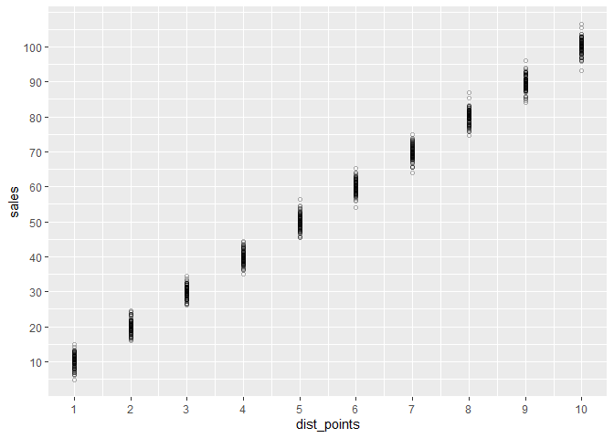<!-- -->

```r
lm_res_rand1 <- lm(sales ~ dist_points, data = df_randomised1)
summary(lm_res_rand1)
```

```
## 
## Call:
## lm(formula = sales ~ dist_points, data = df_randomised1)
## 
## Residuals:
##     Min      1Q  Median      3Q     Max 
## -6.5935 -1.3047  0.0136  1.3852  7.0969 
## 
## Coefficients:
##             Estimate Std. Error t value Pr(>|t|)    
## (Intercept)  0.06852    0.13697     0.5    0.617    
## dist_points  9.97815    0.02208   452.0   <2e-16 ***
## ---
## Signif. codes:  0 '***' 0.001 '**' 0.01 '*' 0.05 '.' 0.1 ' ' 1
## 
## Residual standard error: 2.005 on 998 degrees of freedom
## Multiple R-squared:  0.9951,	Adjusted R-squared:  0.9951 
## F-statistic: 2.043e+05 on 1 and 998 DF,  p-value: < 2.2e-16
```

```r
# Coefficients:
#     Estimate Std. Error t value Pr(>|t|)    
# (Intercept) -0.02126    0.13835  -0.154    0.878    
# dist_points 10.00073    0.02230 448.526   <2e-16 ***
#     ---
#     Signif. codes:  0 ‘***’ 0.001 ‘**’ 0.01 ‘*’ 0.05 ‘.’ 0.1 ‘ ’ 1
# 
# Residual standard error: 2.025 on 998 degrees of freedom
# Multiple R-squared:  0.9951,	Adjusted R-squared:  0.9951 
# F-statistic: 2.012e+05 on 1 and 998 DF,  p-value: < 2.2e-16

# coeffcient standard error went up!!!
```

```r
pred_lm_res_rand1 <- tibble(y = predict(lm_res_rand1, tibble(dist_points = df_randomised1$dist_points)) , dist_points = df_randomised1$dist_points)

(plt_rand1 + geom_line(data = pred_lm_res_rand1, aes(x = dist_points, y = y), col = 'red')
)
```

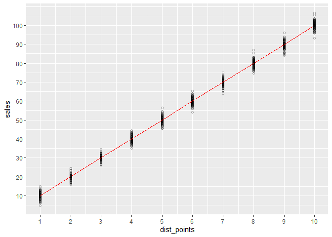<!-- -->


### how do the coefficient standard errors look like?

```r
mean_distpoint <- mean(df_randomised1$dist_points)
# 5.5

pred_lm_res_rand_comp1 <- pred_lm_res_rand1 %>%
    bind_cols(sales = df_randomised1$sales) %>% 
    mutate(diff_sales = y - sales,
           diff_dist_point_mean = dist_points - mean_distpoint)
```


```r
library(ggbeeswarm)
# per dist point?
pred_lm_res_rand_comp1 %>% 
    ggplot(aes(x = dist_points, y = diff_sales)) +
    # geom_point(shape = 1) +
    geom_quasirandom(shape = 1) + 
    scale_x_continuous(breaks = seq(1,10))
```

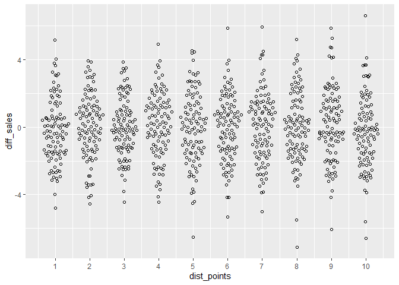<!-- -->

```r
# all look similarly distributed
```


```r
# all together
pred_lm_res_rand_comp1 %>% 
    ggplot(aes(x = 0, y = diff_sales)) +
    geom_quasirandom(shape = 1) +
    scale_x_continuous(breaks = seq(1,10))
```

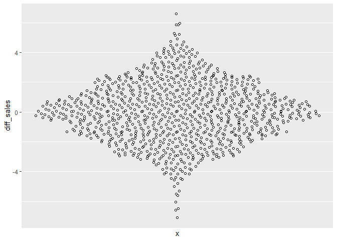<!-- -->


```r
# Real calculation:
# https://stats.stackexchange.com/questions/236437/how-to-compute-the-standard-error-of-a-predictor-variable
# mean squared error
mse <- sum(pred_lm_res_rand_comp1$diff_sales^2) * (1 / (length(pred_lm_res_rand_comp1$diff_sales)-2)  )
x_deviation_mean_error <- sum(pred_lm_res_rand_comp1$diff_dist_point_mean^2)
sqrt(mse/x_deviation_mean_error)
```

```
## [1] 0.02207502
```

```r
# 0.02207502

# Approximation: ??? does this really work ??????
# https://stackoverflow.com/questions/2676554/in-r-how-to-find-the-standard-error-of-the-mean
# knowing that the spread in y is similar
# knowing that the spread in x is similar
std_err_overall <- sqrt(var(pred_lm_res_rand_comp1$diff_sales)/length(pred_lm_res_rand_comp1$diff_sales))
# 0.06337391
std_error_approximation <- std_err_overall / sqrt(mean_distpoint)
# 0.02702273
```


# Example 3 -------------------------------------------------------------------------------------------------------
Use curated with randomness and vary the standard deviation


```r
df_randomised2 <- data.frame(
    dist_points = rep(df$dist_points, 100)
) %>% 
    mutate(sales = dist_points * 10+ rnorm(n(), mean = 0, sd = 4))

df_randomised2 %>% nrow
```

```
## [1] 1000
```

```r
# 1000

(plt_rand2 <- df_randomised2 %>% 
        ggplot(aes(x = dist_points, y = sales)) +
        geom_point(shape = 1, alpha = 0.3) +
        scale_x_continuous(breaks = seq(1,10)) +
        scale_y_continuous(breaks = seq(10,100,10))
)
```

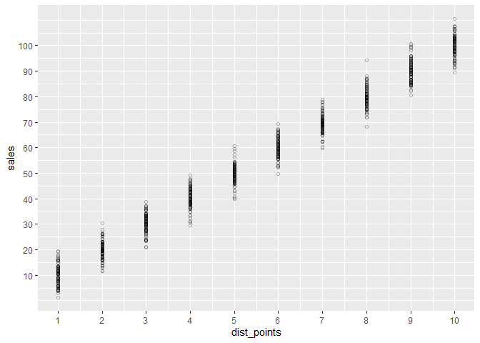<!-- -->

```r
lm_res_rand2 <- lm(sales ~ dist_points, data = df_randomised2)
summary(lm_res_rand2)
```

```
## 
## Call:
## lm(formula = sales ~ dist_points, data = df_randomised2)
## 
## Residuals:
##      Min       1Q   Median       3Q      Max 
## -11.5989  -2.6849  -0.0449   2.6422  14.4537 
## 
## Coefficients:
##             Estimate Std. Error t value Pr(>|t|)    
## (Intercept)  0.18496    0.26948   0.686    0.493    
## dist_points  9.96250    0.04343 229.391   <2e-16 ***
## ---
## Signif. codes:  0 '***' 0.001 '**' 0.01 '*' 0.05 '.' 0.1 ' ' 1
## 
## Residual standard error: 3.945 on 998 degrees of freedom
## Multiple R-squared:  0.9814,	Adjusted R-squared:  0.9814 
## F-statistic: 5.262e+04 on 1 and 998 DF,  p-value: < 2.2e-16
```

```r
# Coefficients:
#     Estimate Std. Error t value Pr(>|t|)    
# (Intercept)  0.18496    0.26948   0.686    0.493    
# dist_points  9.96250    0.04343 229.391   <2e-16 ***
#     ---
#     Signif. codes:  0 ‘***’ 0.001 ‘**’ 0.01 ‘*’ 0.05 ‘.’ 0.1 ‘ ’ 1
# 
# Residual standard error: 3.945 on 998 degrees of freedom
# Multiple R-squared:  0.9814,	Adjusted R-squared:  0.9814 
# F-statistic: 5.262e+04 on 1 and 998 DF,  p-value: < 2.2e-16

# coeff standard error is twice as hight
# residual standard error is also almost twice as high
```


```r
df_randomised3 <- data.frame(
    dist_points = rep(df$dist_points, 100)
) %>% 
    mutate(sales = dist_points * 10+ rnorm(n(), mean = 0, sd = 40))

df_randomised3 %>% nrow
```

```
## [1] 1000
```

```r
# 1000

(plt_rand3 <- df_randomised3 %>% 
        ggplot(aes(x = dist_points, y = sales)) +
        geom_point(shape = 1, alpha = 0.3) +
        scale_x_continuous(breaks = seq(1,10)) +
        scale_y_continuous(breaks = seq(-100,200,10))
)
```

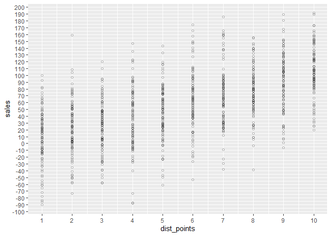<!-- -->

```r
lm_res_rand3 <- lm(sales ~ dist_points, data = df_randomised3)
summary(lm_res_rand3)
```

```
## 
## Call:
## lm(formula = sales ~ dist_points, data = df_randomised3)
## 
## Residuals:
##      Min       1Q   Median       3Q      Max 
## -127.124  -25.084    0.598   26.483  140.669 
## 
## Coefficients:
##             Estimate Std. Error t value Pr(>|t|)    
## (Intercept)  -2.8061     2.8131  -0.998    0.319    
## dist_points  10.4869     0.4534  23.131   <2e-16 ***
## ---
## Signif. codes:  0 '***' 0.001 '**' 0.01 '*' 0.05 '.' 0.1 ' ' 1
## 
## Residual standard error: 41.18 on 998 degrees of freedom
## Multiple R-squared:  0.349,	Adjusted R-squared:  0.3484 
## F-statistic:   535 on 1 and 998 DF,  p-value: < 2.2e-16
```

```r
# Coefficients:
#     Estimate Std. Error t value Pr(>|t|)    
# (Intercept)  -2.8061     2.8131  -0.998    0.319    
# dist_points  10.4869     0.4534  23.131   <2e-16 ***
#     ---
#     Signif. codes:  0 ‘***’ 0.001 ‘**’ 0.01 ‘*’ 0.05 ‘.’ 0.1 ‘ ’ 1
# 
# Residual standard error: 41.18 on 998 degrees of freedom
# Multiple R-squared:  0.349,	Adjusted R-squared:  0.3484 
# F-statistic:   535 on 1 and 998 DF,  p-value: < 2.2e-16

# coefficient stays the same.
# standard error increased by 10 (p value still significant)
# R squared - questionable!!!!
```


```r
df_randomised4 <- data.frame(
    dist_points = rep(df$dist_points, 100)
) %>% 
    mutate(sales = dist_points * 10+ rnorm(n(), mean = 0, sd = 400))

df_randomised4 %>% nrow
```

```
## [1] 1000
```

```r
# 1000

(plt_rand4 <- df_randomised4 %>% 
        ggplot(aes(x = dist_points, y = sales)) +
        geom_point(shape = 1, alpha = 0.3) +
        scale_x_continuous(breaks = seq(1,10)) +
        scale_y_continuous(breaks = seq(-1500,1500,10))
)
```

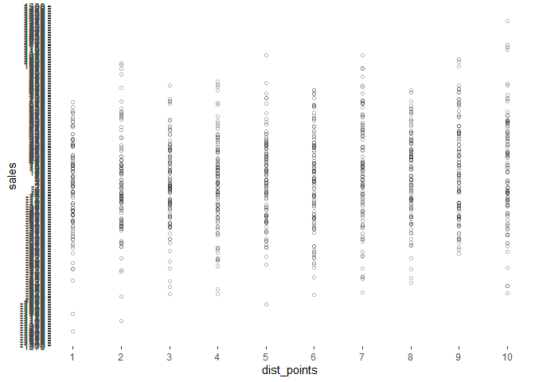<!-- -->

```r
lm_res_rand4 <- lm(sales ~ dist_points, data = df_randomised4)
summary(lm_res_rand4)
```

```
## 
## Call:
## lm(formula = sales ~ dist_points, data = df_randomised4)
## 
## Residuals:
##      Min       1Q   Median       3Q      Max 
## -1214.45  -277.61    -8.64   269.71  1246.09 
## 
## Coefficients:
##             Estimate Std. Error t value Pr(>|t|)    
## (Intercept)  -48.349     27.019  -1.789   0.0738 .  
## dist_points   17.206      4.355   3.951 8.32e-05 ***
## ---
## Signif. codes:  0 '***' 0.001 '**' 0.01 '*' 0.05 '.' 0.1 ' ' 1
## 
## Residual standard error: 395.5 on 998 degrees of freedom
## Multiple R-squared:  0.0154,	Adjusted R-squared:  0.01442 
## F-statistic: 15.61 on 1 and 998 DF,  p-value: 8.319e-05
```

```r
# Coefficients:
#     Estimate Std. Error t value Pr(>|t|)    
# (Intercept)  -48.349     27.019  -1.789   0.0738 .  
# dist_points   17.206      4.355   3.951 8.32e-05 ***
#     ---
#     Signif. codes:  0 ‘***’ 0.001 ‘**’ 0.01 ‘*’ 0.05 ‘.’ 0.1 ‘ ’ 1
# 
# Residual standard error: 395.5 on 998 degrees of freedom
# Multiple R-squared:  0.0154,	Adjusted R-squared:  0.01442 
# F-statistic: 15.61 on 1 and 998 DF,  p-value: 8.319e-05
```
intercept changed to -48!!!!!!!!!!
coeff .. changed to 17 !!!!!!!!
p value still significant
Very bad R squared!!!!!!!


# Example 4 -------------------------------------------------------------------------------------------------------
Use curated with randomness, reduce datasize
try to break p value !!!!


```r
# Chagned coeff to be 1 !!!!!!!!!!
df_randomised_v2_1 <- data.frame(
    dist_points = rep(df$dist_points, 5)
) %>% 
    mutate(sales = dist_points * 1 + rnorm(n(), mean = 0, sd = 20))

df_randomised_v2_1 %>% nrow
```

```
## [1] 50
```

```r
# 50

(plt_rand_v2_1 <- df_randomised_v2_1 %>% 
        ggplot(aes(x = dist_points, y = sales)) +
        geom_point(shape = 1, alpha = 0.3) +
        scale_x_continuous(breaks = seq(1,10)) +
        scale_y_continuous(breaks = seq(-40,200,10))
)
```

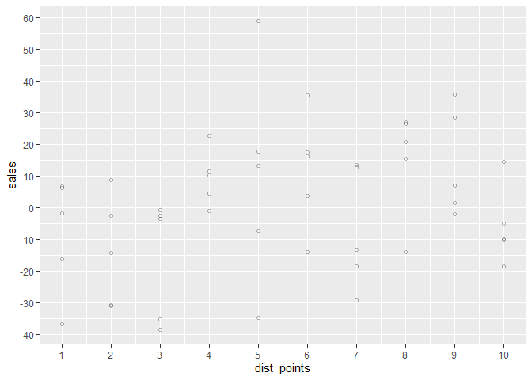<!-- -->

```r
lm_res_randv2_1 <- lm(sales ~ dist_points, data = df_randomised_v2_1)
summary(lm_res_randv2_1)
```

```
## 
## Call:
## lm(formula = sales ~ dist_points, data = df_randomised_v2_1)
## 
## Residuals:
##     Min      1Q  Median      3Q     Max 
## -34.797 -16.846   2.564  14.380  59.129 
## 
## Coefficients:
##             Estimate Std. Error t value Pr(>|t|)  
## (Intercept)  -10.042      6.234  -1.611   0.1138  
## dist_points    1.990      1.005   1.981   0.0534 .
## ---
## Signif. codes:  0 '***' 0.001 '**' 0.01 '*' 0.05 '.' 0.1 ' ' 1
## 
## Residual standard error: 20.41 on 48 degrees of freedom
## Multiple R-squared:  0.07555,	Adjusted R-squared:  0.05629 
## F-statistic: 3.923 on 1 and 48 DF,  p-value: 0.05338
```

```r
# Coefficients:
#     Estimate Std. Error t value Pr(>|t|)   
# (Intercept)   -9.578      6.781  -1.412   0.1643   
# dist_points    3.085      1.093   2.823   0.0069 **
#     ---
#     Signif. codes:  0 ‘***’ 0.001 ‘**’ 0.01 ‘*’ 0.05 ‘.’ 0.1 ‘ ’ 1
# 
# Residual standard error: 22.19 on 48 degrees of freedom
# Multiple R-squared:  0.1424,	Adjusted R-squared:  0.1245 
# F-statistic: 7.969 on 1 and 48 DF,  p-value: 0.006905
```

# low r squared
# coef: 3.085


# !!!!!!!!!!!!!!!!!!!!!!!!!!!!!!!!!!!!!!!!!!!!!!!!!!!!!!!!!!!!!!!!!!!!!!!!!!!!!!!!!!!!!!!!!!!!!!!!!!!!!!!

```r
set.seed(42)
df_randomised_v2_2 <- data.frame(
    dist_points = rep(df$dist_points, 5)
) %>% 
    mutate(sales = dist_points * 1 + rnorm(n(), mean = 0, sd = 7))

df_randomised_v2_2 %>% nrow
```

```
## [1] 50
```

```r
# 50

(plt_rand_v2_2 <- df_randomised_v2_2 %>% 
        ggplot(aes(x = dist_points, y = sales)) +
        geom_point(shape = 1, alpha = 0.8) +
        scale_x_continuous(breaks = seq(1,10)) +
        scale_y_continuous(breaks = seq(-40,200,10))
)
```

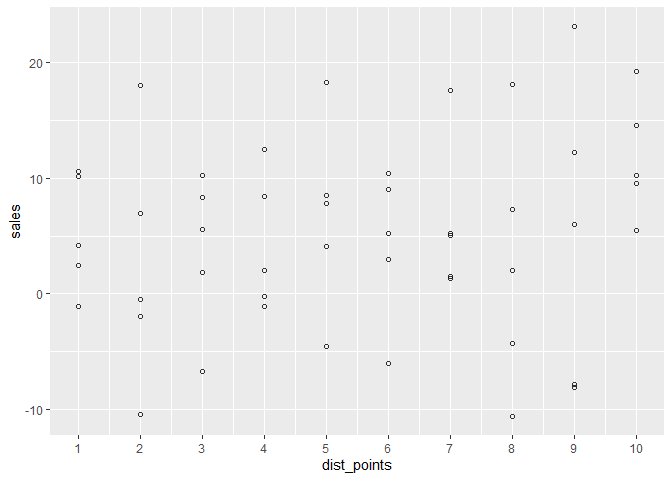<!-- -->

```r
lm_res_randv2_2 <- lm(sales ~ dist_points, data = df_randomised_v2_2)
summary(lm_res_randv2_2)
```

```
## 
## Call:
## lm(formula = sales ~ dist_points, data = df_randomised_v2_2)
## 
## Residuals:
##      Min       1Q   Median       3Q      Max 
## -16.9713  -4.4053  -0.4725   4.7778  16.3026 
## 
## Coefficients:
##             Estimate Std. Error t value Pr(>|t|)
## (Intercept)   2.7736     2.4388   1.137    0.261
## dist_points   0.4503     0.3930   1.146    0.258
## 
## Residual standard error: 7.983 on 48 degrees of freedom
## Multiple R-squared:  0.02662,	Adjusted R-squared:  0.006339 
## F-statistic: 1.313 on 1 and 48 DF,  p-value: 0.2576
```

```r
# Coefficients:
#     Estimate Std. Error t value Pr(>|t|)
# (Intercept)   2.7736     2.4388   1.137    0.261
# dist_points   0.4503     0.3930   1.146    0.258
# 
# Residual standard error: 7.983 on 48 degrees of freedom
# Multiple R-squared:  0.02662,	Adjusted R-squared:  0.006339 
# F-statistic: 1.313 on 1 and 48 DF,  p-value: 0.2576
```

low r squared
coef: 0.4503


```r
pred_lm_res_randv2_2 <- tibble(y = predict(lm_res_randv2_2, tibble(dist_points = df_randomised_v2_2$dist_points)) , dist_points = df_randomised_v2_2$dist_points)

(plt_rand_v2_2 + geom_line(data = pred_lm_res_randv2_2, aes(x = dist_points, y = y), col = 'red')
)
```

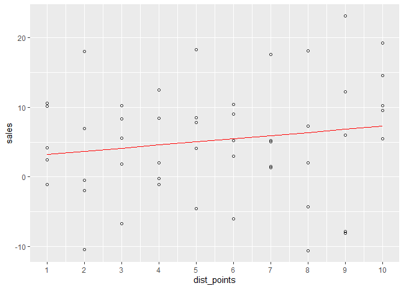<!-- -->


# Example 5 -------------------------------------------------------------------------------------------------------
Use curated with randomness, obscure data set at certain dist_points


```r
set.seed(42)
df_randomised_obsc1 <- data.frame(
    dist_points = rep(df$dist_points, 10)
) %>% 
    mutate(sales = dist_points * 1 + rnorm(n(), mean = 0, sd = 2))

df_randomised_obsc1 %>% nrow
```

```
## [1] 100
```

```r
# 1000

(plt_rand_obs_1 <- df_randomised_obsc1 %>% 
        ggplot(aes(x = dist_points, y = sales)) +
        geom_point(shape = 1, alpha = 0.3) +
        scale_x_continuous(breaks = seq(1,10)) +
        scale_y_continuous(breaks = seq(-20,20,10))
)
```

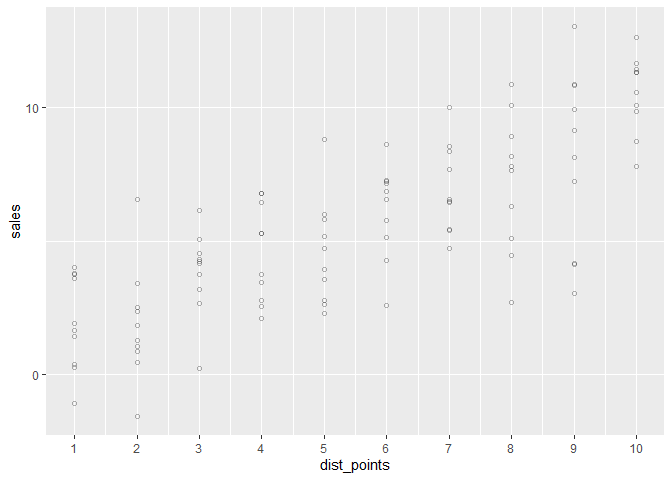<!-- -->

```r
lm_res_rand_obsc1 <- lm(sales ~ dist_points, data = df_randomised_obsc1)
summary(lm_res_rand_obsc1)
```

```
## 
## Call:
## lm(formula = sales ~ dist_points, data = df_randomised_obsc1)
## 
## Residuals:
##     Min      1Q  Median      3Q     Max 
## -5.6516 -1.4413  0.0612  1.3142  4.3714 
## 
## Coefficients:
##             Estimate Std. Error t value Pr(>|t|)    
## (Intercept)  0.69300    0.44651   1.552    0.124    
## dist_points  0.88582    0.07196  12.310   <2e-16 ***
## ---
## Signif. codes:  0 '***' 0.001 '**' 0.01 '*' 0.05 '.' 0.1 ' ' 1
## 
## Residual standard error: 2.067 on 98 degrees of freedom
## Multiple R-squared:  0.6073,	Adjusted R-squared:  0.6033 
## F-statistic: 151.5 on 1 and 98 DF,  p-value: < 2.2e-16
```

```r
# Coefficients:
#     Estimate Std. Error t value Pr(>|t|)    
# (Intercept)  0.69300    0.44651   1.552    0.124    
# dist_points  0.88582    0.07196  12.310   <2e-16 ***
#     ---
#     Signif. codes:  0 ‘***’ 0.001 ‘**’ 0.01 ‘*’ 0.05 ‘.’ 0.1 ‘ ’ 1
# 
# Residual standard error: 2.067 on 98 degrees of freedom
# Multiple R-squared:  0.6073,	Adjusted R-squared:  0.6033 
# F-statistic: 151.5 on 1 and 98 DF,  p-value: < 2.2e-16


pred_lm_res_randobsc_1 <- tibble(y = predict(lm_res_randv2_2, tibble(dist_points = df_randomised_obsc1$dist_points)) , dist_points = df_randomised_obsc1$dist_points)

(plt_rand_obs_1 + geom_line(data = pred_lm_res_randobsc_1, aes(x = dist_points, y = y), col = 'red')
)
```

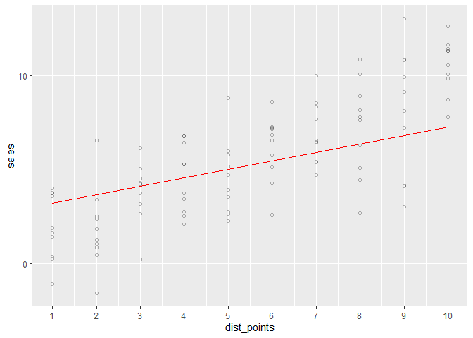<!-- -->


now lets offset dist points 1 and 4, by 5

r squared will reduce
intercept will increase
coef will decrease
residual standard error will increase


```r
set.seed(42)
df_randomised_obsc2 <- data.frame(
    dist_points = rep(df$dist_points, 10)
) %>% 
    mutate(sales = dist_points * 1 + rnorm(n(), mean = 0, sd = 2)) %>% 
    mutate(sales = ifelse(dist_points == 1 | dist_points == 4, sales + 5, sales))

df_randomised_obsc2 %>% nrow
```

```
## [1] 100
```

```r
# 100

(plt_rand_obs_2 <- df_randomised_obsc2 %>% 
        ggplot(aes(x = dist_points, y = sales)) +
        geom_point(shape = 1, alpha = 0.3) +
        scale_x_continuous(breaks = seq(1,10)) +
        scale_y_continuous(breaks = seq(-20,20,10))
)
```

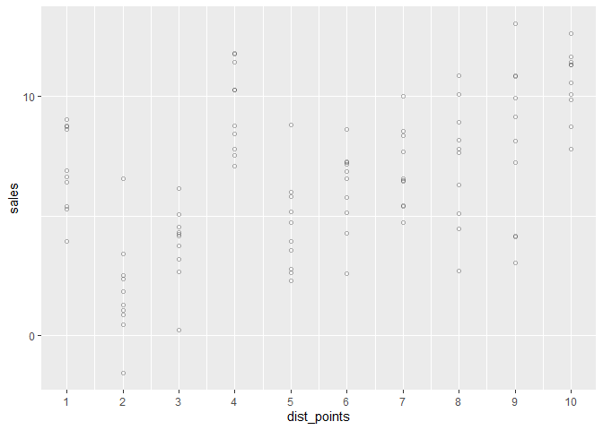<!-- -->

```r
lm_res_rand_obsc2 <- lm(sales ~ dist_points, data = df_randomised_obsc2)
summary(lm_res_rand_obsc2)
```

```
## 
## Call:
## lm(formula = sales ~ dist_points, data = df_randomised_obsc2)
## 
## Residuals:
##     Min      1Q  Median      3Q     Max 
## -6.3000 -1.9990 -0.1921  2.1992  6.0177 
## 
## Coefficients:
##             Estimate Std. Error t value Pr(>|t|)    
## (Intercept)  3.69300    0.60822   6.072 2.40e-08 ***
## dist_points  0.52219    0.09802   5.327 6.36e-07 ***
## ---
## Signif. codes:  0 '***' 0.001 '**' 0.01 '*' 0.05 '.' 0.1 ' ' 1
## 
## Residual standard error: 2.816 on 98 degrees of freedom
## Multiple R-squared:  0.2246,	Adjusted R-squared:  0.2166 
## F-statistic: 28.38 on 1 and 98 DF,  p-value: 6.365e-07
```

```r
# Coefficients:
#     Estimate Std. Error t value Pr(>|t|)    
# (Intercept)  3.29171    0.56376   5.839 6.84e-08 ***
#     dist_points  0.57955    0.09086   6.379 5.91e-09 ***
#     ---
#     Signif. codes:  0 ‘***’ 0.001 ‘**’ 0.01 ‘*’ 0.05 ‘.’ 0.1 ‘ ’ 1
# 
# Residual standard error: 2.61 on 98 degrees of freedom
# Multiple R-squared:  0.2934,	Adjusted R-squared:  0.2862 
# F-statistic: 40.69 on 1 and 98 DF,  p-value: 5.914e-09
```

```r
pred_lm_res_randobsc_2 <- tibble(y = predict(lm_res_rand_obsc2, tibble(dist_points = df_randomised_obsc2$dist_points)) , dist_points = df_randomised_obsc2$dist_points)

(plt_rand_obs_2 + geom_line(data = pred_lm_res_randobsc_2, aes(x = dist_points, y = y), col = 'red')
)
```

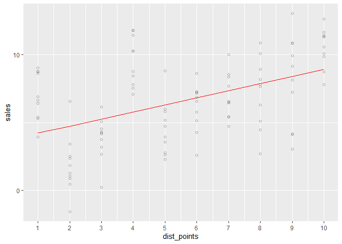<!-- -->
r squared reduced massively!!!
intercept increased
coef decreased 
residual standard error increased slightly
