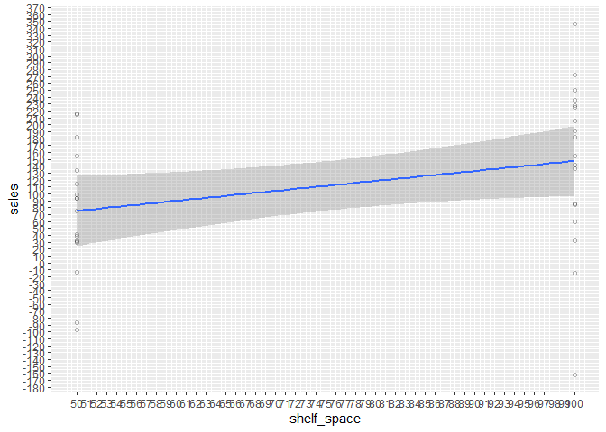

std error is dependent on
- n data points
- shared sigma similarily distributed
- distribution on x axis closer or wider


# Setup -------------------------------------------------------------------------------------------------------


## 1 Example: sigma -------------------------------------

# expected sigma
# p values are significant


```r
df_normal <- 
    expand.grid(dist_points = rep(1:10, 1),
                shelf_space = rep(50:100, 1)
    ) %>% 
    mutate(sales = dist_points * dist_points_k + dist_points_d + rnorm(n(), mean = 0, sd = 4) +
               shelf_space * shelf_space_k + shelf_space_d + rnorm(n(), mean = 0, sd = 100)
    )
```


```r
df_normal <- 
    expand.grid(dist_points = rep(1:10, 1),
                shelf_space = rep(50:100, 1)
    ) %>% 
    mutate(sales = dist_points * dist_points_k + dist_points_d + rnorm(n(), mean = 0, sd = 4) +
               shelf_space * shelf_space_k + shelf_space_d + rnorm(n(), mean = 0, sd = 100)
    )

(df_normal %>% 
        ggplot(aes(x = shelf_space, y = sales)) +
        geom_point(shape = 1, alpha = 0.3) +
        scale_x_continuous(breaks = 50:100) +
        scale_y_continuous(breaks = seq(-700,700,10)) +
        geom_smooth(method = lm)
)
```

```
## `geom_smooth()` using formula 'y ~ x'
```

<!-- -->


```r
(df_normal %>% 
        ggplot(aes(x = shelf_space, y = sales)) +
        geom_point(shape = 1, alpha = 0.3) +
        geom_smooth(method = lm) + 
        scale_x_continuous(breaks = 50:100) +
        scale_y_continuous(breaks = seq(-700,700,10))+
        geom_smooth(method = lm)
)
```

```
## `geom_smooth()` using formula 'y ~ x'
## `geom_smooth()` using formula 'y ~ x'
```

<!-- -->


```r
df_normal_randomised <- lm(sales ~ dist_points + shelf_space, data = df_normal)
summary(df_normal_randomised)
```

```
## 
## Call:
## lm(formula = sales ~ dist_points + shelf_space, data = df_normal)
## 
## Residuals:
##     Min      1Q  Median      3Q     Max 
## -344.01  -64.30    5.31   63.63  308.46 
## 
## Coefficients:
##             Estimate Std. Error t value Pr(>|t|)    
## (Intercept) -26.9964    23.1771  -1.165    0.245    
## dist_points   9.9867     1.4580   6.849 2.15e-11 ***
## shelf_space   1.4123     0.2845   4.964 9.45e-07 ***
## ---
## Signif. codes:  0 '***' 0.001 '**' 0.01 '*' 0.05 '.' 0.1 ' ' 1
## 
## Residual standard error: 94.58 on 507 degrees of freedom
## Multiple R-squared:  0.1237,	Adjusted R-squared:  0.1202 
## F-statistic: 35.78 on 2 and 507 DF,  p-value: 2.918e-15
```

```r
# Coefficients:
#     Estimate Std. Error t value Pr(>|t|)    
# (Intercept) -30.8404    24.6726  -1.250    0.212    
# dist_points  11.8000     1.5521   7.602 1.42e-13 ***
#     shelf_space   1.3189     0.3029   4.355 1.61e-05 ***
```


```r
df_normal %>% nrow
```

```
## [1] 510
```

```r
# 510
```


Instead of normal distribution, use a uniform distribution but with the same mean!
p values are not significant


```r
df_unifdist <- 
    expand.grid(dist_points = rep(1:10, 1),
                shelf_space = rep(50:100, 1)
    ) %>% 
    mutate(sales = dist_points * dist_points_k + dist_points_d + runif(n(), min = 0, max = 500) +
               shelf_space * shelf_space_k + shelf_space_d + runif(n(), min = 0, max = 500)
    )

(df_unifdist %>% 
        ggplot(aes(x = shelf_space, y = sales)) +
        geom_point(shape = 1, alpha = 0.3) +
        scale_x_continuous(breaks = 50:100) +
        scale_y_continuous(breaks = seq(-700,1500,10)) +
        geom_smooth(method = lm)
)
```

```
## `geom_smooth()` using formula 'y ~ x'
```

<!-- -->


```r
(df_unifdist %>% 
        ggplot(aes(x = shelf_space, y = sales)) +
        geom_point(shape = 1, alpha = 0.3) +
        geom_smooth(method = lm) + 
        scale_x_continuous(breaks = 50:100) +
        scale_y_continuous(breaks = seq(-700,1500,10))+
        geom_smooth(method = lm)
)
```

```
## `geom_smooth()` using formula 'y ~ x'
## `geom_smooth()` using formula 'y ~ x'
```

<!-- -->


```r
lm_unifdist <- lm(sales ~ dist_points + shelf_space, data = df_unifdist)
summary(lm_unifdist)
```

```
## 
## Call:
## lm(formula = sales ~ dist_points + shelf_space, data = df_unifdist)
## 
## Residuals:
##     Min      1Q  Median      3Q     Max 
## -475.55 -145.97   -9.22  139.74  490.88 
## 
## Coefficients:
##             Estimate Std. Error t value Pr(>|t|)    
## (Intercept)  445.208     49.362   9.019  < 2e-16 ***
## dist_points    9.168      3.105   2.952  0.00330 ** 
## shelf_space    1.943      0.606   3.206  0.00143 ** 
## ---
## Signif. codes:  0 '***' 0.001 '**' 0.01 '*' 0.05 '.' 0.1 ' ' 1
## 
## Residual standard error: 201.4 on 507 degrees of freedom
## Multiple R-squared:  0.03611,	Adjusted R-squared:  0.03231 
## F-statistic: 9.497 on 2 and 507 DF,  p-value: 8.93e-05
```

```r
# Coefficients:
#     Estimate Std. Error t value Pr(>|t|)    
# (Intercept) 513.6269    51.0026  10.071  < 2e-16 ***
#     dist_points   8.8988     3.2085   2.774  0.00575 ** 
#     shelf_space   0.7164     0.6261   1.144  0.25305  
```

both parameters not significant!!!!!!!!!
just because we went from a normal distribution to a uniform distribution!!!!


## 2 Example: X axis more wide -------------------------------------
We set the x axis wider
this should produce higher p values than the initial model!


```r
df_wider_x <- 
    expand.grid(dist_points = rep(c(1,10), 5),
                shelf_space = rep(c(50,100), 5)
    ) %>% 
    mutate(sales = dist_points * dist_points_k + dist_points_d + rnorm(n(), mean = 0, sd = 4) +
               shelf_space * shelf_space_k + shelf_space_d + rnorm(n(), mean = 0, sd = 100)
    )

(df_wider_x %>% 
        ggplot(aes(x = shelf_space, y = sales)) +
        geom_point(shape = 1, alpha = 0.3) +
        scale_x_continuous(breaks = 50:100) +
        scale_y_continuous(breaks = seq(-700,700,10)) +
        geom_smooth(method = lm)
)
```

```
## `geom_smooth()` using formula 'y ~ x'
```

<!-- -->


```r
(df_wider_x %>% 
        ggplot(aes(x = shelf_space, y = sales)) +
        geom_point(shape = 1, alpha = 0.3) +
        geom_smooth(method = lm) + 
        scale_x_continuous(breaks = 50:100) +
        scale_y_continuous(breaks = seq(-700,700,10))+
        geom_smooth(method = lm)
)
```

```
## `geom_smooth()` using formula 'y ~ x'
## `geom_smooth()` using formula 'y ~ x'
```

<!-- -->


For comparisson, here is the data that we are comparing to:

```r
summary(df_normal_randomised)
```

```
## 
## Call:
## lm(formula = sales ~ dist_points + shelf_space, data = df_normal)
## 
## Residuals:
##     Min      1Q  Median      3Q     Max 
## -344.01  -64.30    5.31   63.63  308.46 
## 
## Coefficients:
##             Estimate Std. Error t value Pr(>|t|)    
## (Intercept) -26.9964    23.1771  -1.165    0.245    
## dist_points   9.9867     1.4580   6.849 2.15e-11 ***
## shelf_space   1.4123     0.2845   4.964 9.45e-07 ***
## ---
## Signif. codes:  0 '***' 0.001 '**' 0.01 '*' 0.05 '.' 0.1 ' ' 1
## 
## Residual standard error: 94.58 on 507 degrees of freedom
## Multiple R-squared:  0.1237,	Adjusted R-squared:  0.1202 
## F-statistic: 35.78 on 2 and 507 DF,  p-value: 2.918e-15
```

```r
# Coefficients:
#     Estimate Std. Error t value Pr(>|t|)    
# (Intercept) -30.8404    24.6726  -1.250    0.212    
# dist_points  11.8000     1.5521   7.602 1.42e-13 ***
#     shelf_space   1.3189     0.3029   4.355 1.61e-05 ***
```


This is the data we came up with, with wider x axis!!!

```r
df_wider_x %>% nrow
```

```
## [1] 100
```


```r
lm_wider_x <- lm(sales ~ dist_points + shelf_space, data = df_wider_x)
summary(lm_wider_x)
```

```
## 
## Call:
## lm(formula = sales ~ dist_points + shelf_space, data = df_wider_x)
## 
## Residuals:
##     Min      1Q  Median      3Q     Max 
## -239.56  -75.99   15.96   69.13  271.52 
## 
## Coefficients:
##             Estimate Std. Error t value Pr(>|t|)    
## (Intercept) -70.2452    37.6549  -1.865 0.065134 .  
## dist_points   9.6974     2.4682   3.929 0.000160 ***
## shelf_space   1.7725     0.4443   3.990 0.000128 ***
## ---
## Signif. codes:  0 '***' 0.001 '**' 0.01 '*' 0.05 '.' 0.1 ' ' 1
## 
## Residual standard error: 111.1 on 97 degrees of freedom
## Multiple R-squared:  0.2443,	Adjusted R-squared:  0.2287 
## F-statistic: 15.68 on 2 and 97 DF,  p-value: 1.26e-06
```

```r
# Coefficients:
#     Estimate Std. Error t value Pr(>|t|)    
# (Intercept)  32.7824    32.9597   0.995    0.322    
# dist_points  14.1725     2.1604   6.560 2.63e-09 ***
#     shelf_space   0.2059     0.3889   0.529    0.598   
```

p value lower for both coefficients!!!!!!!!!!!!!!!!!!!!!!!!!!!!!!!!


## 3 Example: less data -------------------------------------


```r
df_wider_x_less_data <- 
    expand.grid(dist_points = rep(c(1,10), 3),
                shelf_space = rep(c(50,100), 3)
    ) %>% 
    mutate(sales = dist_points * dist_points_k + dist_points_d + rnorm(n(), mean = 0, sd = 4) +
               shelf_space * shelf_space_k + shelf_space_d + rnorm(n(), mean = 0, sd = 100)
    )

(df_wider_x_less_data %>% 
        ggplot(aes(x = shelf_space, y = sales)) +
        geom_point(shape = 1, alpha = 0.3) +
        scale_x_continuous(breaks = 50:100) +
        scale_y_continuous(breaks = seq(-700,700,10)) +
        geom_smooth(method = lm)
)
```

```
## `geom_smooth()` using formula 'y ~ x'
```

<!-- -->


```r
(df_wider_x_less_data %>% 
        ggplot(aes(x = shelf_space, y = sales)) +
        geom_point(shape = 1, alpha = 0.3) +
        geom_smooth(method = lm) + 
        scale_x_continuous(breaks = 50:100) +
        scale_y_continuous(breaks = seq(-700,700,10))+
        geom_smooth(method = lm)
)
```

```
## `geom_smooth()` using formula 'y ~ x'
## `geom_smooth()` using formula 'y ~ x'
```

<!-- -->


```r
lm_wider_x_less_data <- lm(sales ~ dist_points + shelf_space, data = df_wider_x_less_data)
summary(lm_wider_x_less_data)
```

```
## 
## Call:
## lm(formula = sales ~ dist_points + shelf_space, data = df_wider_x_less_data)
## 
## Residuals:
##      Min       1Q   Median       3Q      Max 
## -273.169  -71.669    4.088   62.212  162.989 
## 
## Coefficients:
##             Estimate Std. Error t value Pr(>|t|)  
## (Intercept) -40.7950    56.7253  -0.719   0.4771  
## dist_points   7.9453     3.7182   2.137   0.0401 *
## shelf_space   1.4431     0.6693   2.156   0.0384 *
## ---
## Signif. codes:  0 '***' 0.001 '**' 0.01 '*' 0.05 '.' 0.1 ' ' 1
## 
## Residual standard error: 100.4 on 33 degrees of freedom
## Multiple R-squared:  0.2183,	Adjusted R-squared:  0.1709 
## F-statistic: 4.608 on 2 and 33 DF,  p-value: 0.01719
```

```r
# Coefficients:
#     Estimate Std. Error t value Pr(>|t|)    
# (Intercept) -16.5979    54.6248  -0.304 0.763148    
# dist_points  14.1408     3.5805   3.949 0.000388 ***
#     shelf_space   0.7148     0.6445   1.109 0.275437   
```

p-value is even lower


