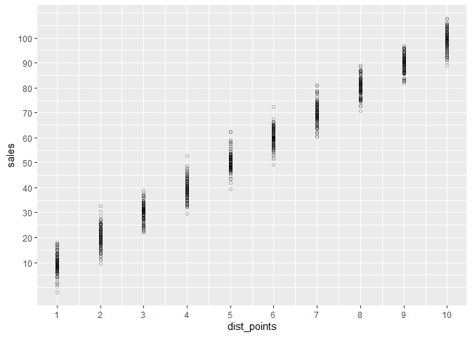
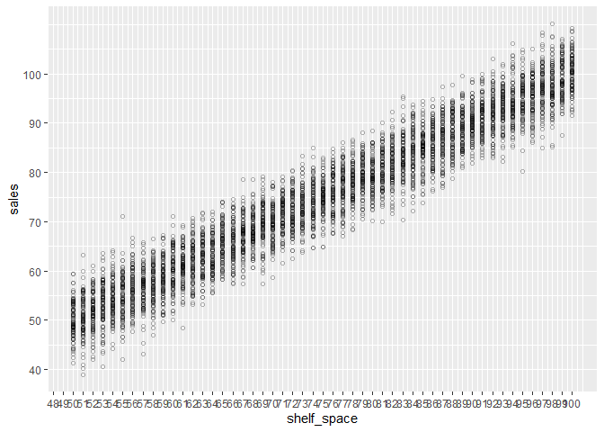

R squared: refer to 011_simple_linear_regression.R


# Setup -------------------------------------------------------------------------------------------------------

```r
library(tidyverse)
```

```
## -- Attaching packages --------------------------------------- tidyverse 1.3.0 --
```

```
## v ggplot2 3.3.2     v purrr   0.3.4
## v tibble  3.0.4     v dplyr   1.0.2
## v tidyr   1.1.2     v stringr 1.4.0
## v readr   1.4.0     v forcats 0.5.0
```

```
## -- Conflicts ------------------------------------------ tidyverse_conflicts() --
## x dplyr::filter() masks stats::filter()
## x dplyr::lag()    masks stats::lag()
```

```r
# Initial input data -------------------------------------------------------------------------------------------------------
dist_points_k <- 10
dist_points_d <- 0
dist_points_sigma <- 4

df_distpoints <-
    data.frame(dist_points = rep(1:10, 100) ) %>% 
    mutate(sales = dist_points * dist_points_k + dist_points_d + rnorm(n(), mean = 0, sd = dist_points_sigma))

df_distpoints %>% 
    ggplot(aes(x = dist_points, y = sales)) +
    geom_point(shape = 1, alpha = 0.3) +
    scale_x_continuous(breaks = seq(1,10)) +
    scale_y_continuous(breaks = seq(10,100,10))
```

<!-- -->


```r
shelf_space_k <- 1
shelf_space_d <- 0
shelf_space_sigma <- 4

df_shelfspace <-
    data.frame(shelf_space = rep(50:100, 100) ) %>% # 50% until 100% 
    mutate(sales = shelf_space * shelf_space_k + shelf_space_d + rnorm(n(), mean = 0, sd = shelf_space_sigma))

df_shelfspace %>% 
    ggplot(aes(x = shelf_space, y = sales)) +
    geom_point(shape = 1, alpha = 0.3) +
    scale_x_continuous(breaks = seq(1,100)) +
    scale_y_continuous(breaks = seq(10,100,10))
```

<!-- -->


# Example 1 -------------------------------------------------------------------------------------------------------
R squared vs adjusted R squared 


```r
df_combinded_norandom <- 
    expand.grid(dist_points = rep(1:10, 10),
                shelf_space = rep(50:100, 10)
    ) %>% 
    mutate(sales = dist_points * dist_points_k + dist_points_d +
               shelf_space * shelf_space_k + shelf_space_d
    )

df_combinded_norandom %>% nrow
```

```
## [1] 51000
```


```r
## 1 parameter
# Expecation: R squared and adjusted R squared should be equal
lm_1param_distpoints <- lm(sales ~ dist_points, data = df_combinded_norandom)
summary(lm_1param_distpoints)
```

```
## 
## Call:
## lm(formula = sales ~ dist_points, data = df_combinded_norandom)
## 
## Residuals:
##    Min     1Q Median     3Q    Max 
##    -25    -13      0     13     25 
## 
## Coefficients:
##             Estimate Std. Error t value Pr(>|t|)    
## (Intercept) 75.00000    0.14081   532.6   <2e-16 ***
## dist_points 10.00000    0.02269   440.7   <2e-16 ***
## ---
## Signif. codes:  0 '***' 0.001 '**' 0.01 '*' 0.05 '.' 0.1 ' ' 1
## 
## Residual standard error: 14.72 on 50998 degrees of freedom
## Multiple R-squared:  0.792,	Adjusted R-squared:  0.792 
## F-statistic: 1.942e+05 on 1 and 50998 DF,  p-value: < 2.2e-16
```

```r
# Coefficients:
#     Estimate Std. Error t value Pr(>|t|)    
# (Intercept) 75.00000    0.14081   532.6   <2e-16 ***
#     dist_points 10.00000    0.02269   440.7   <2e-16 ***
#     ---
#     Signif. codes:  0 ‘***’ 0.001 ‘**’ 0.01 ‘*’ 0.05 ‘.’ 0.1 ‘ ’ 1
# 
# Residual standard error: 14.72 on 50998 degrees of freedom
# Multiple R-squared:  0.792,	Adjusted R-squared:  0.792 
# F-statistic: 1.942e+05 on 1 and 50998 DF,  p-value: < 2.2e-16
```

Multiple R-squared:  0.792,	Adjusted R-squared:  0.792 -> equal !!!!!!!!!
low p value !!!!


```r
lm_1param_shelf_space <- lm(sales ~ shelf_space, data = df_combinded_norandom)
summary(lm_1param_shelf_space)
```

```
## 
## Call:
## lm(formula = sales ~ shelf_space, data = df_combinded_norandom)
## 
## Residuals:
##    Min     1Q Median     3Q    Max 
##    -45    -25      0     25     45 
## 
## Coefficients:
##              Estimate Std. Error t value Pr(>|t|)    
## (Intercept) 55.000000   0.660424   83.28   <2e-16 ***
## shelf_space  1.000000   0.008641  115.73   <2e-16 ***
## ---
## Signif. codes:  0 '***' 0.001 '**' 0.01 '*' 0.05 '.' 0.1 ' ' 1
## 
## Residual standard error: 28.72 on 50998 degrees of freedom
## Multiple R-squared:  0.208,	Adjusted R-squared:  0.208 
## F-statistic: 1.339e+04 on 1 and 50998 DF,  p-value: < 2.2e-16
```

```r
# Coefficients:
#     Estimate Std. Error t value Pr(>|t|)    
# (Intercept) 55.000000   0.660424   83.28   <2e-16 ***
#     shelf_space  1.000000   0.008641  115.73   <2e-16 ***
#     ---
#     Signif. codes:  0 ‘***’ 0.001 ‘**’ 0.01 ‘*’ 0.05 ‘.’ 0.1 ‘ ’ 1
# 
# Residual standard error: 28.72 on 50998 degrees of freedom
# Multiple R-squared:  0.208,	Adjusted R-squared:  0.208 
# F-statistic: 1.339e+04 on 1 and 50998 DF,  p-value: < 2.2e-16
```

Multiple R-squared:  0.208,	Adjusted R-squared:  0.208  -> equal !!!!!!!!!
low p value  !!!!


Perfect fit!

```r
lm_2param_norandom <- lm(sales ~ dist_points + shelf_space, data = df_combinded_norandom)
summary(lm_2param_norandom)
```

```
## 
## Call:
## lm(formula = sales ~ dist_points + shelf_space, data = df_combinded_norandom)
## 
## Residuals:
##        Min         1Q     Median         3Q        Max 
## -5.445e-09 -1.000e-13  1.000e-13  3.000e-13  2.063e-10 
## 
## Coefficients:
##               Estimate Std. Error    t value Pr(>|t|)    
## (Intercept) -2.714e-11  5.967e-13 -4.549e+01   <2e-16 ***
## dist_points  1.000e+01  3.754e-14  2.664e+14   <2e-16 ***
## shelf_space  1.000e+00  7.325e-15  1.365e+14   <2e-16 ***
## ---
## Signif. codes:  0 '***' 0.001 '**' 0.01 '*' 0.05 '.' 0.1 ' ' 1
## 
## Residual standard error: 2.435e-11 on 50997 degrees of freedom
## Multiple R-squared:      1,	Adjusted R-squared:      1 
## F-statistic: 4.481e+28 on 2 and 50997 DF,  p-value: < 2.2e-16
```

```r
# Coefficients:
#     Estimate Std. Error    t value Pr(>|t|)    
# (Intercept) -2.714e-11  5.967e-13 -4.549e+01   <2e-16 ***
#     dist_points  1.000e+01  3.754e-14  2.664e+14   <2e-16 ***
#     shelf_space  1.000e+00  7.325e-15  1.365e+14   <2e-16 ***
#     ---
#     Signif. codes:  0 ‘***’ 0.001 ‘**’ 0.01 ‘*’ 0.05 ‘.’ 0.1 ‘ ’ 1
# 
# Residual standard error: 2.435e-11 on 50997 degrees of freedom
# Multiple R-squared:      1,	Adjusted R-squared:      1 
# F-statistic: 4.481e+28 on 2 and 50997 DF,  p-value: < 2.2e-16
```


Lets generate an example with more coefficients

```r
df_combinded_modif <- 
    expand.grid(dist_points = rep(1:10, 1),
                shelf_space = rep(50:100, 1)
    ) %>% 
    mutate(                rand_x1 = runif(n()),
                           rand_x2 = runif(n()),
                           rand_x3 = runif(n()),
                           rand_x4 = runif(n()),
                           rand_x5 = runif(n()),
                           rand_x6 = runif(n()),
                           rand_x7 = runif(n()),
                           rand_x8 = runif(n()),
                           rand_x9 = runif(n()),
                           rand_x10 = runif(n())
                           ) %>% 
    mutate(sales = dist_points * dist_points_k + dist_points_d + rnorm(n(), mean = 0, sd = dist_points_sigma) +
               shelf_space * shelf_space_k + shelf_space_d + rnorm(n(), mean = 0, sd = shelf_space_sigma)
    )

df_combinded_modif %>% nrow
```

```
## [1] 510
```


```r
lm_12param <- lm(sales ~ ., data = df_combinded_modif)
summary(lm_12param)
```

```
## 
## Call:
## lm(formula = sales ~ ., data = df_combinded_modif)
## 
## Residuals:
##      Min       1Q   Median       3Q      Max 
## -16.0404  -4.2733   0.1762   4.2030  19.7261 
## 
## Coefficients:
##             Estimate Std. Error t value Pr(>|t|)    
## (Intercept) -0.09672    2.06050  -0.047   0.9626    
## dist_points  9.94571    0.09102 109.266   <2e-16 ***
## shelf_space  0.99352    0.01776  55.939   <2e-16 ***
## rand_x1      1.40205    0.88001   1.593   0.1117    
## rand_x2      0.23710    0.89614   0.265   0.7914    
## rand_x3     -1.66092    0.92890  -1.788   0.0744 .  
## rand_x4     -0.11623    0.92680  -0.125   0.9002    
## rand_x5     -0.61860    0.89963  -0.688   0.4920    
## rand_x6      0.02458    0.88962   0.028   0.9780    
## rand_x7      0.96585    0.88176   1.095   0.2739    
## rand_x8      0.80876    0.90248   0.896   0.3706    
## rand_x9      0.55614    0.92766   0.600   0.5491    
## rand_x10     0.20055    0.89092   0.225   0.8220    
## ---
## Signif. codes:  0 '***' 0.001 '**' 0.01 '*' 0.05 '.' 0.1 ' ' 1
## 
## Residual standard error: 5.845 on 497 degrees of freedom
## Multiple R-squared:  0.9687,	Adjusted R-squared:  0.9679 
## F-statistic:  1282 on 12 and 497 DF,  p-value: < 2.2e-16
```

```r
# Coefficients:
#     Estimate Std. Error t value Pr(>|t|)    
# (Intercept) -1.666492   2.086430  -0.799    0.425    
# dist_points 10.020939   0.091482 109.540   <2e-16 ***
#     shelf_space  1.012533   0.017889  56.601   <2e-16 ***
#     rand_x1     -1.619556   0.913895  -1.772    0.077 .  
# rand_x2      0.081665   0.896940   0.091    0.927    
# rand_x3      0.008887   0.921198   0.010    0.992    
# rand_x4      0.104281   0.866666   0.120    0.904    
# rand_x5     -0.257795   0.917209  -0.281    0.779    
# rand_x6      1.400948   0.913762   1.533    0.126    
# rand_x7      0.820087   0.895443   0.916    0.360    
# rand_x8      0.564252   0.915456   0.616    0.538    
# rand_x9      0.003492   0.971189   0.004    0.997    
# rand_x10     0.297085   0.915243   0.325    0.746    
# ---
#     Signif. codes:  0 ‘***’ 0.001 ‘**’ 0.01 ‘*’ 0.05 ‘.’ 0.1 ‘ ’ 1
# 
# Residual standard error: 5.872 on 497 degrees of freedom
# Multiple R-squared:  0.969,	Adjusted R-squared:  0.9682 
# F-statistic:  1293 on 12 and 497 DF,  p-value: < 2.2e-16
```

Multiple R-squared:  0.969,	Adjusted R-squared:  0.9682 !!!!!
adjusted smaller than normal r squared!!!!!!!


# Example 2 -------------------------------------------------------------------------------------------------------
F score and p value

only random parameters
Expectation: low r squared, high p value


```r
lm_rand_params <- lm(sales ~ rand_x1 + rand_x2 + rand_x3 + rand_x4 + rand_x5 +
                         rand_x6 + rand_x7 + rand_x8 + rand_x9 + rand_x10, data = df_combinded_modif)
summary(lm_rand_params)
```

```
## 
## Call:
## lm(formula = sales ~ rand_x1 + rand_x2 + rand_x3 + rand_x4 + 
##     rand_x5 + rand_x6 + rand_x7 + rand_x8 + rand_x9 + rand_x10, 
##     data = df_combinded_modif)
## 
## Residuals:
##     Min      1Q  Median      3Q     Max 
## -75.031 -23.832   0.239  25.880  78.964 
## 
## Coefficients:
##             Estimate Std. Error t value Pr(>|t|)    
## (Intercept) 139.5127     7.9645  17.517   <2e-16 ***
## rand_x1       3.6681     4.9084   0.747    0.455    
## rand_x2      -4.9078     4.9976  -0.982    0.327    
## rand_x3      -4.0481     5.1823  -0.781    0.435    
## rand_x4      -0.4119     5.1673  -0.080    0.936    
## rand_x5      -3.4045     5.0168  -0.679    0.498    
## rand_x6       4.6060     4.9632   0.928    0.354    
## rand_x7      -6.7962     4.9006  -1.387    0.166    
## rand_x8       5.7134     5.0320   1.135    0.257    
## rand_x9      -6.6696     5.1653  -1.291    0.197    
## rand_x10     -6.5873     4.9645  -1.327    0.185    
## ---
## Signif. codes:  0 '***' 0.001 '**' 0.01 '*' 0.05 '.' 0.1 ' ' 1
## 
## Residual standard error: 32.64 on 499 degrees of freedom
## Multiple R-squared:  0.01968,	Adjusted R-squared:  3.137e-05 
## F-statistic: 1.002 on 10 and 499 DF,  p-value: 0.4408
```

```r
# Multiple R-squared:  0.01804,	Adjusted R-squared:  -0.001635 
# F-statistic: 0.9169 on 10 and 499 DF,  p-value: 0.5171
```

low r squared, high p value


what happens if one param is now contributing to the sales?
Expectation: higher r squared, significant p value 


```r
lm_2contrib_rand_params <- lm(sales ~ dist_points + shelf_space + 
                         rand_x1 + rand_x2 + rand_x3 + rand_x4 + rand_x5 +
                         rand_x6 + rand_x7 + rand_x8 + rand_x9 + rand_x10, data = df_combinded_modif)
summary(lm_2contrib_rand_params)
```

```
## 
## Call:
## lm(formula = sales ~ dist_points + shelf_space + rand_x1 + rand_x2 + 
##     rand_x3 + rand_x4 + rand_x5 + rand_x6 + rand_x7 + rand_x8 + 
##     rand_x9 + rand_x10, data = df_combinded_modif)
## 
## Residuals:
##      Min       1Q   Median       3Q      Max 
## -16.0404  -4.2733   0.1762   4.2030  19.7261 
## 
## Coefficients:
##             Estimate Std. Error t value Pr(>|t|)    
## (Intercept) -0.09672    2.06050  -0.047   0.9626    
## dist_points  9.94571    0.09102 109.266   <2e-16 ***
## shelf_space  0.99352    0.01776  55.939   <2e-16 ***
## rand_x1      1.40205    0.88001   1.593   0.1117    
## rand_x2      0.23710    0.89614   0.265   0.7914    
## rand_x3     -1.66092    0.92890  -1.788   0.0744 .  
## rand_x4     -0.11623    0.92680  -0.125   0.9002    
## rand_x5     -0.61860    0.89963  -0.688   0.4920    
## rand_x6      0.02458    0.88962   0.028   0.9780    
## rand_x7      0.96585    0.88176   1.095   0.2739    
## rand_x8      0.80876    0.90248   0.896   0.3706    
## rand_x9      0.55614    0.92766   0.600   0.5491    
## rand_x10     0.20055    0.89092   0.225   0.8220    
## ---
## Signif. codes:  0 '***' 0.001 '**' 0.01 '*' 0.05 '.' 0.1 ' ' 1
## 
## Residual standard error: 5.845 on 497 degrees of freedom
## Multiple R-squared:  0.9687,	Adjusted R-squared:  0.9679 
## F-statistic:  1282 on 12 and 497 DF,  p-value: < 2.2e-16
```

```r
# Multiple R-squared:  0.7689,	Adjusted R-squared:  0.7638 
# F-statistic: 150.7 on 11 and 498 DF,  p-value: < 2.2e-16
# higher r squared
# significant p value
```


```r
lm_1contrib_rand_params <- lm(sales ~ dist_points + 
                                  rand_x1 + rand_x2 + rand_x3 + rand_x4 + rand_x5 +
                                  rand_x6 + rand_x7 + rand_x8 + rand_x9 + rand_x10, data = df_combinded_modif)
summary(lm_1contrib_rand_params)
```

```
## 
## Call:
## lm(formula = sales ~ dist_points + rand_x1 + rand_x2 + rand_x3 + 
##     rand_x4 + rand_x5 + rand_x6 + rand_x7 + rand_x8 + rand_x9 + 
##     rand_x10, data = df_combinded_modif)
## 
## Residuals:
##     Min      1Q  Median      3Q     Max 
## -33.971 -12.692   0.086  12.217  37.983 
## 
## Coefficients:
##             Estimate Std. Error t value Pr(>|t|)    
## (Intercept) 76.61780    4.14971  18.463   <2e-16 ***
## dist_points  9.94561    0.24562  40.492   <2e-16 ***
## rand_x1     -0.17617    2.37342  -0.074    0.941    
## rand_x2     -2.06932    2.41559  -0.857    0.392    
## rand_x3     -4.09324    2.50382  -1.635    0.103    
## rand_x4      2.52458    2.49766   1.011    0.313    
## rand_x5      0.99918    2.42633   0.412    0.681    
## rand_x6      0.07405    2.40057   0.031    0.975    
## rand_x7      2.33947    2.37845   0.984    0.326    
## rand_x8      3.48133    2.43184   1.432    0.153    
## rand_x9     -3.02791    2.49723  -1.213    0.226    
## rand_x10    -2.36793    2.40088  -0.986    0.324    
## ---
## Signif. codes:  0 '***' 0.001 '**' 0.01 '*' 0.05 '.' 0.1 ' ' 1
## 
## Residual standard error: 15.77 on 498 degrees of freedom
## Multiple R-squared:  0.7716,	Adjusted R-squared:  0.7666 
## F-statistic:   153 on 11 and 498 DF,  p-value: < 2.2e-16
```

```r
# Multiple R-squared:  0.969,	Adjusted R-squared:  0.9682 
# F-statistic:  1293 on 12 and 497 DF,  p-value: < 2.2e-16
```

higher r squared
significant p value

